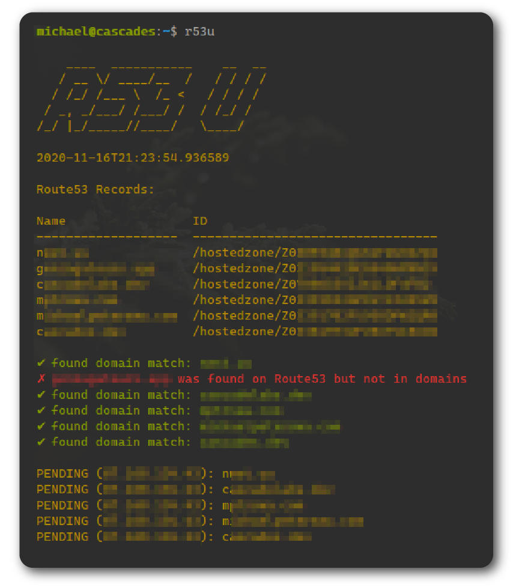
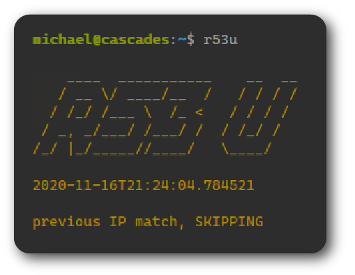

<h1 align="center">
	
</h1>
<h3 align="center">
	Route53Updater is a Python script that performs Dynamic DNS with Route53
</h3>
<p align="center">
	<strong>
		<a href="https://aws.amazon.com/route53/">AWS Route 53</a>
		•
		<a href="https://boto3.amazonaws.com/v1/documentation/api/latest/index.html">Boto3 library</a>
		•
		<a href="https://crontab.guru/">crontab.guru</a>
	</strong>
</p>
<p align="center">
  
  
</p>

## Installation
```
git clone git@github.com:michaelpeterswa/Route53Updater.git
pip3 install -r requirements.txt
python3 update.py
```
Or download the file manually.

See additional installation steps below.

## Runtime
<h4 align="center">
If the previous IP doesn't match:
</h4>
<h3 align="center">
	
</h3>
<h4 align="center">
If the previous IP does match:
</h4>
<h3 align="center">
	
</h3>

## (Optional Installation Steps)

Ensure update.py (line 16) contains the full path to your config file:
```
CONFIG = "/home/user/Route53Updater/domains.toml"
```
Symlink the script:
```
ln -s /home/user/Route53Updater/update.py /usr/local/bin/r53u
chmod +x /usr/local/bin/r53u
```
Edit Crontab:
```
crontab -e
```
To run every 5 minutes append this line:
```
*/5 * * * * usr/local/bin/r53u > /home/user/r53u.log 2>&1
```

## Release History

1.0.0 (11.16.20)

## Meta

Michael Peters - michael@michaelpeterswa.com
       
## License   

MIT, see [LICENSE](LICENSE)
